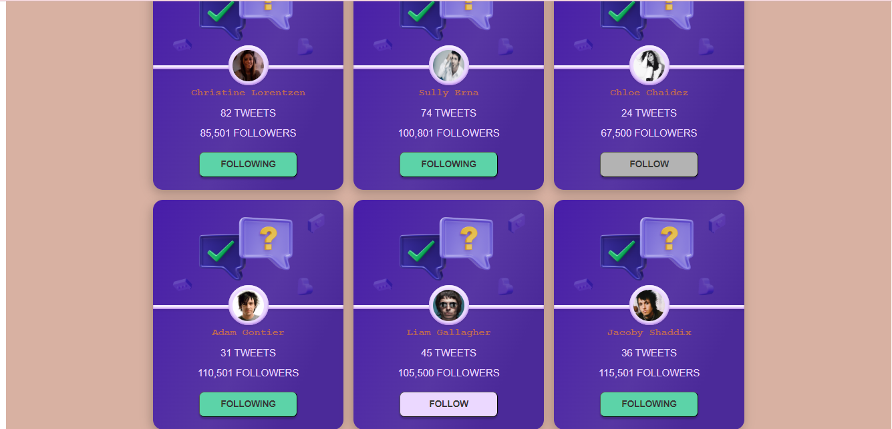

<a id='suda'></a>

# Test-proj

At last version - this project is a test task, current version has type script upgrade.

___
## Description

_It has collection of rock singers' tweets from the API. You can get data on the number of tweets and followers._ 

___
### Technologyes that i used in this project:
     

```

- axios
- react-router-dom
- react-icons
- react-loader-spinner
- styled-components & styled-system
```

### `Getting Started`

- clone the repository
- install all dependencies
- and start )


[back to the begining](#suda)